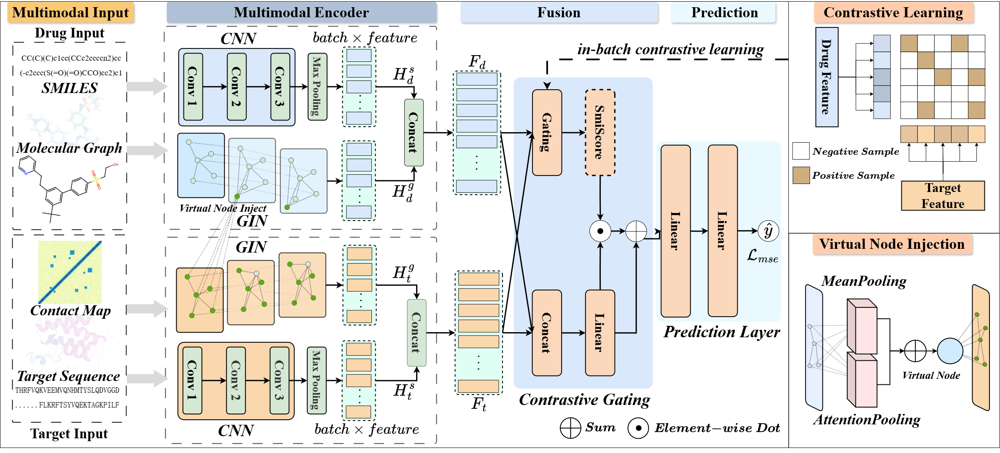

# PCG-DTA
Note: All names and hyperlinks have been anonymized to comply with double-blind rules, and all supplementary links provided are open-source resources from the cited references.
## Table of Contents

- [PCG-DTA](#PCG-DTA)
  - [Table of Contents](#table-of-contents)
  - [Abstract](#abstract)
  - [Model Architecture](#model-architecture)
  - [Datasets](#datasets)
  - [System requirements](#system-requirements)
  - [Installation and Requirements](#installation-and-requirements)
  - [Supplementary Materials and Code](#supplementary-materials-and-code)
  - [Run](#run)
    - [1. Train](#1-train)
    - [2. Test](#2-test)
## Abstract
Drug-target affinity prediction is pivotal for accelerating drug discovery.
However, existing deep learning methods still face three critical bottlenecks that limit their out-of-distribution generalization.
First, they often rely on limited input modalities, causing a severe loss of crucial structural and topological information.
Second, drugs and targets are typically encoded in complete isolation, preventing the model from capturing essential interaction information to late-stage feature fusion.
Third, conventional prediction networks often exhibit weak discriminative capability when processing fused representations. In cold-start scenarios, this makes it challenging for the model to accurately distinguish between strong and weak affinities.
To overcome these bottlenecks, we propose PCG-DTA, a multimodal framework incorporating virtual node injection and contrastive gating. 
Specifically, the framework employs a joint graph-sequence architecture for comprehensive feature extraction. 
Subsequently, to break independent encoding, a virtual node injection mechanism enables early-stage dynamic information exchange between drugs and targets, simulating biological induced-fit interactions. 
Furthermore, to enhance discriminative capability, a contrastive gating mechanism establishes a coarse-grained matching prior for drug-target binding, providing an accurate discriminative basis to ensure fine-grained affinity predictions.
Extensive experiments demonstrate that PCG-DTA significantly outperforms state-of-the-art methods under cold-start settings, and visualization analyses further confirm its robust feature discriminative capacity.
## Model Architecture


The overall architecture of the proposed PCG-DTA framework. The model systematically integrates four main components: Multimodal Input, which constructs drug molecular graphs using RDKit and extracts target protein contact maps utilizing PconsC4; Multimodal Encoder, responsible for extracting domain-specific topological features from the heterogeneous inputs while leveraging virtual node injection (take drug-target interaction as an example) to provide drug-target interaction awareness; Fusion, facilitating deep cross-entity interactions; and Prediction, which employs contrastive (CLIP) gating, where SimScore acts as a cosine similarity scalar, to enhance discriminative capacity.
## Datasets
This method utilizes the **Davis** and **KIBA** benchmark datasets, which are located in the `./data` directory.
**Table: Summary of the datasets used in our experiments.**
For more detailed information regarding these datasets, please refer to:

| Dataset | Drugs | Targets | Interactions | Affinity Metrics |
| :--- | :--- | :--- | :--- | :--- |
| **KIBA** [more details](https://jcheminf.biomedcentral.com/articles/10.1186/s13321-017-0209-z)| 2,111 | 229 | 118,254 | $K_d, K_i$ and $IC_{50}$ |
| **Davis** [more details](http://staff.cs.utu.fi/~aatapa/data/DrugTarget/)| 68 | 442 | 30,056 | $K_d$ |

Specifically, for the 2D graph data, drug molecules are automatically extracted using RDKit, and protein contact maps are obtained using PconsC4 (though you can certainly use more advanced tools like AlphaFold to achieve more accurate intermediate results). 
We follow the pioneering related work MLSDTA[1]; you can access the file via this [link](https://drive.google.com/file/d/1ABjUhkMWNN0Z47nDn0Mk0vMlp7ANctqs/view).
## System requirements 
+ Operating System: Ubuntu 20.04
+ CPU: Intel(R) Xeon(R) Platinum 8352V CPU @ 2.10GHz
+ GPU: RTX 4090(24GB) * 1
+ CUDA:  11.8

## Installation and Requirements

You can install the required dependencies with the following step.

```bash
conda create -n PCGDTA python=3.10 --yes
source activate PCGDTA
pip install torch==2.0.1 torchvision==0.15.2 torchaudio==2.0.2 --index-url https://download.pytorch.org/whl/cu118
pip install torch-scatter torch-sparse torch-cluster torch-spline-conv -f https://data.pyg.org/whl/torch-2.0.1+cu118.html
pip install scikit-learn pandas matplotlib tqdm
pip install torch-geometric
```

## Supplementary Materials and Code
The whole supplementary materials of PCG-DTA including:

+ create_data_csv.py
+ training_validation_Davis_KIBA.py
+ utils.py
+ PCGDTA.py

## Run

### 1. Data Preparation
We follow the cold-start splitting strategy from the pioneering work NHGNN-DTA[2], and the relevant datasets can be accessed [here](https://github.com/hehh77/NHGNN-DTA/tree/main/Code). First, save the CSV files for each dataset into ./data/csv/[dataset_name]. Next, ensure that the corresponding contact map files are placed in ./data/[dataset_name]. Finally, run create_data_csv.py to automatically load and process the data. Please note that this will take some time, as it needs to extract default node features and save the static affinity matrix required for the contrastive gating module.
### 2. Training
Execute training_validation_Davis_KIBA.py to begin training. By default, the model is trained on the Davis dataset first, followed by the KIBA dataset (which requires more time). Additionally, each dataset is trained once across the three cold-start split settings.
### 3. Testing
We have uploaded 3 pre-trained weight files trained on the Davis dataset, which can be loaded directly to run evaluations.

## Reference
[1] Peng, X., Ouyang, C., Liu, Y., Yu, Y., Liu, J., & Chen, M. (2024). Multimodal drug target binding affinity prediction using graph local substructure. IEEE Journal of Biomedical and Health Informatics, 29(3), 1625-1634.

[2] He, H., Chen, G., & Chen, C. Y. C. (2023). NHGNN-DTA: a node-adaptive hybrid graph neural network for interpretable drug–target binding affinity prediction. Bioinformatics, 39(6), btad355.